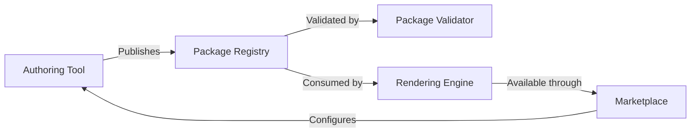

# Architecture Components

The Composite Random Prompt Generator (CRPG) ecosystem is composed of modular components that can be combined into packages and distributed via marketplaces. The sections below outline the core components and their responsibilities.

## Authoring Tool

The authoring tool provides creators with an integrated environment for defining:

- **Packages and Namespaces:** Manage package metadata, declare dependencies, and allocate assets into namespaces.
- **Datatypes:** Describe structured data primitives and complex types used by prompt sections and ontologies.
- **Ontologies:** Model domain-specific vocabularies, relationships, and context for language-aware rendering.
- **Prompt Sections:** Create template-driven building blocks that can reference other sections to produce composite prompts.
- **Separator Sets:** Configure locale-aware separators for enumerations (e.g., `", "`, `" and "`, `", and "`).
- **Morphers:** Define transformations (pluralization, conjugation, casing, localization) applied during rendering.
- **Rulebooks:** Specify root prompt sections, selection logic, and contextual entry points for rendering sessions.

The tool must be able to export packages deterministically given the same inputs and seed.

## Package Validator

The package validator enforces structural and semantic rules, ensuring packages are interoperable across implementations. Key responsibilities include:

- **Schema Validation:** Check manifest structure, namespace declarations, and dependency references.
- **Determinism Checks:** Verify that all randomized elements are seeded and traceable, and that unsupported system randomness is disallowed.
- **Compliance Reporting:** Produce tier-aligned reports so authors know whether their packages meet tier-one, tier-two, or reference requirements.

## Rendering Engine

The rendering engine consumes validated packages and produces deterministic prompt output. Its responsibilities include:

- **Seed Management:** Initialize render sessions with deterministic seeds and expose only allowed system random values.
- **Template Resolution:** Resolve prompt sections recursively, including cross-namespace references.
- **Ontology Integration:** Query ontologies and datatypes for context-aware placeholder resolution.
- **Morpher Application:** Apply morphers and separator sets to ensure grammatically correct output.
- **Rulebook Execution:** Traverse rulebooks to select root prompt sections, manage state, and provide repeatable branching behavior.

## Marketplace

The marketplace (or registry) provides distribution, discovery, and governance features:

- **Package Hosting:** Store published packages with versioning, metadata, and dependency graphs.
- **Compliance Badges:** Display compliance tiers and validator reports.
- **Search & Discovery:** Surface packages by ontology domain, language, or compatibility.
- **Runtime Delivery:** Offer APIs or download endpoints that rendering engines can consume directly.
- **Economy Support (Future):** Enable licensing, monetization, or contribution tracking as part of the broader ecosystem.

## Cross-Cutting Concerns

- **Deterministic Build Pipelines:** Every component must preserve determinism across serialization, network transfer, and rendering.
- **Extensibility:** The spec should allow new asset types (e.g., evaluators, testing suites) without breaking existing packages.
- **Observability:** Logging and tracing should reference deterministic identifiers (UUIDs derived from seeds) where possible.
- **Security & Integrity:** Packages must be signed and verifiable to prevent tampering in marketplaces or during local use.

## Open Questions

- How should ontology versioning and backward compatibility be managed across packages?
- What is the minimal manifest schema required for Tier One compliance?
- Which serialization format ensures both human readability and deterministic parsing (JSON, YAML, or a custom DSL)?
- How will morphers interact with localization frameworks to cover non-Latin scripts or right-to-left languages?
