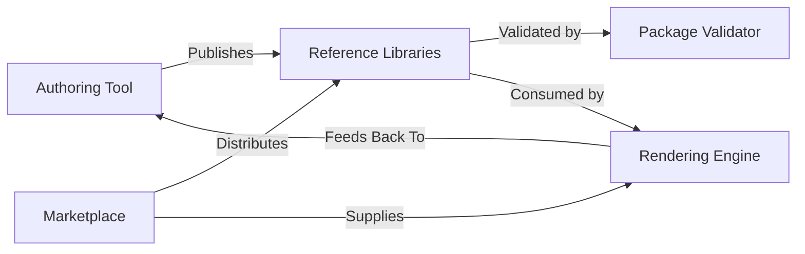
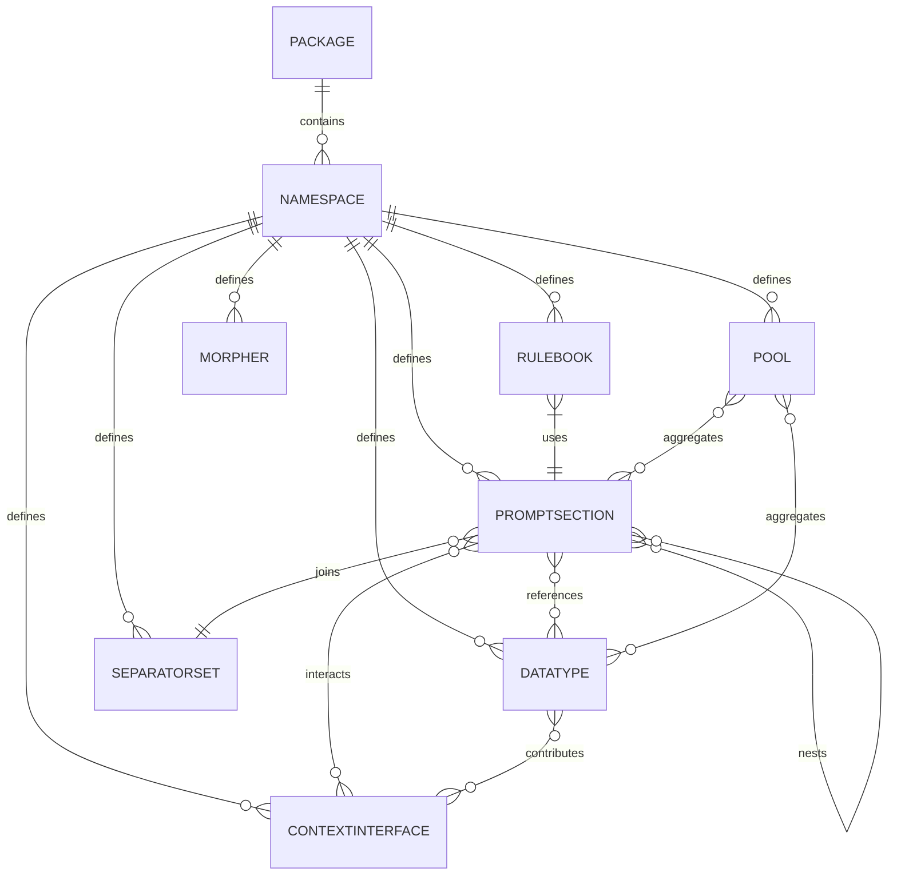

# RPG Architecture & Data Model

The Random Prompt Generator (RPG) ecosystem separates creation, validation, rendering, and distribution so teams can innovate independently while remaining interoperable. This guide summarises the component responsibilities and the shared data model that enables deterministic prompt generation.

## System Components

### Authoring Tool

A lightweight IDE or CLI that packages namespaces, assets, and manifests.

- Visual or structured editors for datatypes, promptsections, separatorsets, rulebooks, pools, morphers, and contextinterfaces.
- Auto-complete and validation for fully qualified references (`namespace:component`).
- Context simulation to preview promptsections and rulebooks with deterministic seeds.
- Deterministic exports (YAML source of truth with JSON mirrors) signed for provenance.

### Package Validator

A static analyser that ensures packages are consistent, deterministic, and marketplace-ready.

- Schema validation for manifests and component definitions.
- Semantic validation (min/max ranges, dependency resolution, contract satisfaction).
- Determinism checks that forbid unseeded randomness and confirm UUID/timestamp derivations.
- Compliance reporting for tiers and validator signatures.

### Rendering Engine

Executes rulebooks to produce prompts while enforcing deterministic behaviour.

- Depth-first template rendering with seeded random services (int, float, choice).
- Scoped context store (global, prompt, section, custom scopes) with request/contribution flow.
- Integration with contextinterfaces for declarative coordination (articles, gender, moods).
- Pool management for collecting and drawing rendered fragments.
- Batch-friendly APIs and observability hooks that emit deterministic identifiers.

### Reference Libraries

Shared namespaces and utilities that speed implementation across teams.

- Canonical `featured.common` package with baseline datatypes, separatorsets, morphers, and contextinterfaces.
- Test fixtures for sanity scenarios and regression suites.
- Language-specific ontologies and morphology packs curated for reuse.

### Marketplace

A registry for publishing and discovering packages.

- Versioned storage with dependency graphs, integrity signatures, and provenance metadata.
- Compliance badge display sourced from validator output.
- Search filters by namespace, tags, locale, and compatibility.
- APIs/CLI commands (`rpg install`, `rpg publish`) for automation.
- Optional monetisation (licensing, revenue sharing) without affecting package formats.

## Core Data Model

RPG assets are data-first and namespaced. The following entities are serialisable to canonical YAML with deterministic JSON mirrors.

- **Package** – Manifest with metadata, dependencies, compliance assertions, and namespace inventory.
- **Namespace** – Logical grouping inside a package (e.g., `featured.common`). Holds component definitions.
- **Datatype** – Namespaced list of values with optional tags (`article: a`, `gender: feminine`). Supports filtering and context contributions.
- **PromptSection** – Template strings combining static text, references, repetition, conditionals, and context operations.
- **SeparatorSet** – Trio of separators (primary, secondary, tertiary) for formatting repetitions.
- **Rulebook** – Weighted entry promptsections, batch configuration, and required contextinterfaces.
- **Pool** – Named collection that aggregates rendered fragments for later draws.
- **ContextInterface** – Declarative specification of context keys, request flags, contributions, and validators.
- **Morpher** – Deterministic transformation rules (pluralisation, conjugation, casing) using context and tags.

### Data Relationships

### Serialization Norms

- Canonical YAML stores sorted keys and explicit anchors when used; JSON mirrors are generated deterministically.
- Identifiers follow `<namespace>:<component>` for cross-package references.
- Packages declare dependencies with semantic version ranges and optional capability tags (e.g., `provides: contracts.language.articles`).
- Morphers and contextinterfaces may extend definitions from dependencies using additive merges.

## Cross-Cutting Requirements

- **Determinism:** All randomness, UUIDs, and timestamps derive from the rendering seed. Authoring and validator outputs must be reproducible.
- **Extensibility:** New component types must declare JSON Schema extensions and compatibility notes without breaking existing packages.
- **Observability:** Logs and traces reference deterministic identifiers. Validation and rendering outputs capture seed, package version, rulebook entry, and context snapshots.
- **Security:** Packages are signed; registries verify integrity before distribution. Validator signatures accompany compliance reports.

## Open Questions

- Governance of shared namespaces like `featured.common` (ownership, change control).
- Strategies for ontology versioning and multilingual fallbacks.
- Reference data format for morphers requiring complex linguistic rules (e.g., CLDR integration).
