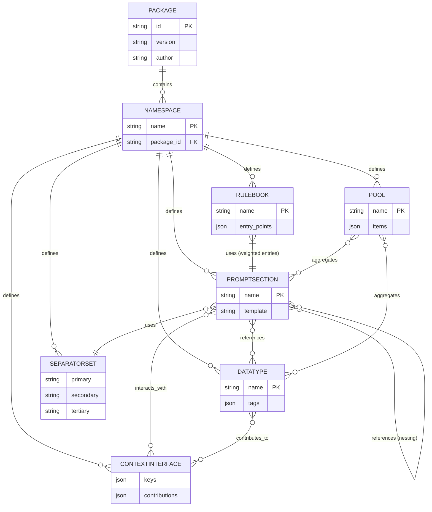

# Exploring the Random Prompt Generator: Components and Data Model

The Random Prompt Generator (RPG) is a modular, extensible system designed for creating dynamic, randomized text prompts. Inspired by single-page application (SPA) stores for its rendering context, RPG empowers authors to build reusable components in packages, validate them, render prompts efficiently, and share via a marketplace. This article breaks down the system's core **components** (Authoring Tool, Package Validator, Rendering Engine, and Marketplace) and its **data model** (focusing on namespaces, rulebooks, promptsections, and more). We'll explore how they interconnect to enable flexible, context-aware prompt generation with minimal hardcoding.

Whether you're an author crafting building blocks or a user generating thousands of prompts, understanding these elements unlocks RPG's full potential. At the end, we'll visualize the data model with a Mermaid ER diagram tailored for VitePress integration.

## System Components

RPG's architecture separates concerns: authoring for creation, validation for quality, rendering for execution, and the marketplace for distribution. Each component is designed for modularity, allowing package authors to mix namespaces from dependencies.

### 1. Authoring Tool
The Authoring Tool is the creative hub—a lightweight IDE or CLI for defining packages, namespaces, and components. It provides syntax highlighting for templates, auto-completion for references (e.g., `{featured.common:animal}`), and previews of rendered prompts.

- **Key Features**:
    - **Package Creation**: Define manifests with metadata (version, author, dependencies) and bundle components.
    - **Component Editing**: Visual editors for datatypes (tag-based data lists), promptsections (templates), and separatorsets (list formatting rules).
    - **Context Simulation**: Mock rendering contexts to test interactions, like article requests fulfilled by downstream nouns.
    - **Dependency Management**: Resolve external namespaces automatically.

- **Workflow Example**: An author in `featured.common` creates a datatype `noun` with tags (`article: a|an`, `gender: neutral`). They define a promptsection template: `"A {featured.common:adjective} {featured.common:noun}."` and simulate outputs to ensure spacing and context flow.

This tool ensures declarative authoring, where logic (e.g., gender agreement) lives in data, not code.

### 2. Package Validator
Before publishing, the Package Validator enforces standards, preventing broken dependencies or invalid syntax. It's a static analyzer that runs locally or in CI, checking against RPG's schema.

- **Key Features**:
    - **Syntax Checks**: Validates templates for balanced braces, valid references, and conditionals.
    - **Semantic Validation**: Ensures min <= max in repetitions, required tags exist, and ContextInterfaces have matching keys/rules.
    - **Dependency Resolution**: Simulates package graphs to detect cycles or missing externals.
    - **Best Practices**: Warns on issues like optional elements without leading spaces (to avoid 0/2-space bugs).

- **Workflow Example**: Validating a package with a rulebook referencing an external `story.elements:plot_twist`—it confirms the dependency is declared and the promptsection exists.

By catching errors early, the validator maintains ecosystem quality without restricting creativity.

### 3. Rendering Engine
The heart of RPG, the Rendering Engine processes rulebooks to generate prompts. It uses a depth-first traversal for templates, maintaining a scoped context store for interactions.

- **Key Features**:
    - **Batch Generation**: For 1000 prompts, it selects weighted entry promptsections, renders them, and outputs variations.
    - **Dynamic Resolution**: Handles repetitions with separatorsets, pool draws, and context requests (e.g., `{context.request(featured.common:article_requested.<prompt>)}`).
    - **Fallbacks and Errors**: Graceful handling of unset context (defaults) or invalid refs (skips with logs).
    - **Performance**: Caches resolved datatypes; supports parallelism for large batches.

- **Workflow Example**: Rendering `"The {featured.common:noun?min=1,max=3&sep=featured.common:comma_and} adventure."` might yield "The cat, dog, and fox adventure."—with articles contributed via context.

This engine keeps logic author-defined, evaluating contributions in render order.

### 4. Marketplace
The Marketplace is a centralized hub for discovering, downloading, and publishing packages. It's a web-based registry (think npm for prompts) with search, ratings, and versioning.

- **Key Features**:
    - **Browsing**: Filter by namespace (e.g., `featured.common`), tags (e.g., "fantasy"), or compatibility.
    - **Publishing**: Upload validated packages; auto-generates docs from manifests.
    - **Integration**: CLI commands like `rpg install story.fantasy` pull dependencies.
    - **Community Tools**: Forums for sharing rulebooks, example prompts, and extension ideas.

- **Workflow Example**: A user searches for "mood enhancers," installs `emotions.vivid`, and mixes it into a custom rulebook with `featured.common`.

The marketplace fosters collaboration, with `featured.common` as a de facto standard library for basics like articles and moods.

## The Data Model

RPG's data model is entity-relationship based, centered on namespaced components stored in packages. Everything is JSON/YAML-serializable for easy packaging. Core entities include:

- **Namespace**: A logical grouping (e.g., `featured.common`) within a package. Multiple per package; enables mixing (e.g., `story.fantasy` depends on `featured.common`).
- **Package**: Container for namespaces, with manifest (id, version, dependencies).
- **Datatype**: Namespaced list of values with tags (e.g., `{animal: cat, article: a, mood: playful}`). Random selection; tags fuel context contributions.
- **PromptSection**: Namespaced template string with references, repetitions (`?min=1,max=3`), conditionals (`{if cond ? true : false}`), and context ops (`{context.get(key)}`).
- **SeparatorSet**: Namespaced trio for lists (primary: ", ", secondary: " and ", tertiary: ", and ").
- **Rulebook**: Namespaced config with weighted entry promptsections (e.g., `{start: 0.7, twist: 0.3}`) for batch generation.
- **Pool**: Optional namespaced aggregator (list in context) for random draws from datatypes/sections.
- **ContextInterface**: Namespaced contract for context keys (e.g., `article_choice`), with rules for contributions (conditions/actions based on tags).

Relationships emphasize reuse: Promptsections reference datatypes/pools/other sections; rulebooks entry into sections; interfaces mediate component interactions.

This model supports extensibility—authors define custom datatypes for languages or domains, all via data.

## Visualizing the Data Model: Mermaid ER Diagram for VitePress

For VitePress (a VuePress successor), embed Mermaid diagrams in Markdown with triple backticks and `mermaid` language. Below is a complete ER diagram code block showing entities, attributes (simplified), and cardinalities. Copy-paste it directly into your `.md` file.

